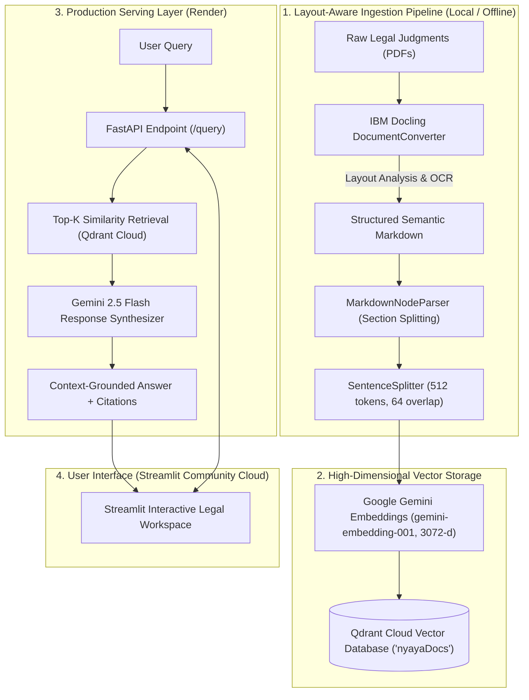

<div align="center">

# NyayaDocs: Production-Grade Legal AI RAG System
### *High-Fidelity Retrieval-Augmented Generation for Supreme Court of India Judgments*

[](https://python.org)
[](https://fastapi.tiangolo.com)
[](https://www.llamaindex.ai/)
[](https://qdrant.tech/)
[](https://ai.google.dev/)
[](https://streamlit.io/)
[](LICENSE)

<br/>

**[Live Streamlit Workspace](https://app-nyayadocs.streamlit.app/)** &nbsp;|&nbsp;
**[Backend API Service](https://nyayadocs.onrender.com)** &nbsp;|&nbsp;
**[Swagger Interactive Docs](https://nyayadocs.onrender.com/docs)**

</div>

---

## Live Deployments

| Component | Platform | URL | Status |
| :--- | :--- | :--- | :--- |
| **Frontend UI** | Streamlit Community Cloud | [https://app-nyayadocs.streamlit.app/](https://app-nyayadocs.streamlit.app/) | Active |
| **Backend REST API** | Render | [https://nyayadocs.onrender.com/](https://nyayadocs.onrender.com/) | Active |
| **API Documentation** | Swagger / OpenAPI | [https://nyayadocs.onrender.com/docs](https://nyayadocs.onrender.com/docs) | Active |
| **Health Check** | Render REST API | [https://nyayadocs.onrender.com/health](https://nyayadocs.onrender.com/health) | Active |

> **Note on Render Free Tier**: The backend service automatically spins down after 15 minutes of inactivity. The initial request or wake-up ping may take 40-50 seconds to start. The Streamlit UI includes a dedicated "Ping / Wake Up Backend" button in the sidebar.

---

## Executive Summary

**NyayaDocs** is an enterprise-grade Retrieval-Augmented Generation (RAG) system engineered to parse, index, and query complex, unstructured legal judgments from the Supreme Court of India.

Legal judgments present unique challenges to traditional RAG architectures: multi-column layouts, nested statutory tables, dense citations, and multi-bench dissents. NyayaDocs solves this through a multi-stage pipeline utilizing **IBM Docling's Vision-Language layout parsing**, **structural Markdown & sentence-aware chunking**, **high-dimensional vector search with Qdrant Cloud**, and **Google Gemini 2.5 Flash** for factually grounded legal reasoning with transparent citations.

---

## System Architecture



---

## Key Engineering Highlights & Innovations

### 1. High-Fidelity Vision-Language Parsing (Docling)
* Traditional PDF parsers (PyPDF, pdfplumber) discard layout hierarchy, table structures, and reading order, resulting in fragmented context.
* NyayaDocs integrates **IBM Docling** to extract multi-column Supreme Court judgments into structured Markdown, preserving tables, headings (`#`, `##`), and footnotes intact.

### 2. Dual-Stage Hierarchical Chunking
* **Stage 1 (Structural)**: `MarkdownNodeParser` partitions documents along legal section headings and judgment headers.
* **Stage 2 (Semantic)**: `SentenceSplitter` ensures passages that exceed token limits are sub-chunked strictly along sentence boundaries with overlapping context, eliminating mid-clause fragmentation.

### 3. Decoupled Production Architecture & Cloud Storage
* Decoupled heavy ingestion dependencies (`docling`, `torch`, `torchvision`) from the query-serving runtime.
* The deployed FastAPI backend runs as a lightweight query microservice on Render Free Tier consuming only **~80 MB RAM**.
* Vector storage is hosted on **Qdrant Cloud**, allowing both the Render FastAPI service and Streamlit Cloud frontend to query identical high-dimensional vectors with sub-millisecond retrieval times.

### 4. Resilient Incremental Ingestion with Rate-Limit Backoff
* File-by-file incremental ingestion tracks already indexed files, allowing interrupted indexing jobs to resume seamlessly without re-parsing PDFs.
* Built-in exponential backoff handles Google Gemini API 429 quota/rate limits automatically.

### 5. Production FastAPI Microservice
* Asynchronous lifespan management that connects to Qdrant Cloud and initializes LLM settings upon server boot.
* Pydantic v2 validation, strict type schemas, and CORS middleware for seamless integration with external clients.
* Endpoints for query synthesis (`/query`), raw chunk retrieval (`/retrieve`), health checks (`/health`), and document browsing.

### 6. Interactive Streamlit Legal Workspace
* Clean dark legal aesthetic featuring expandable source citations with exact confidence scores.
* **Dual-Mode Architecture**: Connects to the deployed FastAPI backend with an automatic graceful fallback to the in-process local pipeline.


## Technical Benchmarks

| Metric | Specification |
| :--- | :--- |
| **Frontend Deployment** | [Streamlit Community Cloud](https://app-nyayadocs.streamlit.app/) |
| **Backend Deployment** | [Render Web Service](https://nyayadocs.onrender.com) |
| **Embedding Model** | `gemini-embedding-001` (3072 Dimensions) |
| **LLM Model** | Google Gemini 2.5 Flash (`gemini-2.5-flash`) |
| **Vector Store** | Qdrant Cloud Cluster (`nyayaDocs` collection) |
| **Chunk Window** | 512 tokens with 64 token overlap |
| **Parsing Engine** | IBM Docling (RapidOCR + Layout Detection) |
| **Backend Latency** | ~1.2s – 2.0s (Retrieval + Gemini 2.5 generation) |

---

## Project Structure

```
NyayaDocs/
├── data/
│   └── 20_pdf/              # Raw Indian Supreme Court judgment PDFs
├── qdrant_storage/          # Local on-disk Qdrant vector database (gitignored)
├── src/
│   ├── Ingestion/
│   │   ├── docling_parser.py # Docling PDF layout parser to semantic Markdown
│   │   ├── chunker.py       # MarkdownNodeParser & SentenceSplitter chunker
│   │   ├── embedding.py     # Gemini embedding-001 configuration & batch sizing
│   │   └── vectordb.py      # Qdrant client pooling, incremental indexing & retry
│   ├── Retrieval/
│   │   ├── __init__.py
│   │   └── retriever.py     # Top-k vector retriever module
│   ├── Query/
│   │   ├── __init__.py
│   │   └── query_engine.py  # Gemini 2.5 Flash synthesis engine
│   └── config.py            # Environment validation, Qdrant Cloud & global paths
├── main.py                  # FastAPI REST API Microservice
├── app.py                   # Streamlit Interactive Legal Research UI
├── render.yaml              # Render infrastructure-as-code deployment blueprint
├── requirements.txt         # Lightweight production dependencies for Render
├── requirements-ingest.txt  # Ingestion dependencies (Docling, Torch) for local parsing
├── pyproject.toml           # Project dependencies managed via UV
├── .env.example             # Environment variable template
└── README.md
```

---

## Quick Start (Local Development)

### 1. Prerequisites
- Python >= 3.11
- [uv](https://docs.astral.sh/uv/) (Extremely fast Python package installer and runner)

### 2. Installation & Environment
Clone the repository and install dependencies:
```bash
git clone https://github.com/AYadav06/NyayaDocs.git
cd NyayaDocs
uv sync
```

Create your `.env` file in the root directory:
```env
GEMINI_API_KEY="your_google_ai_studio_api_key"
LLM_MODEL="gemini-2.5-flash"
EMBEDDING_MODEL="gemini-embedding-001"
QDRANT_URL="your_qdrant_cloud_endpoint"
QDRANT_API_KEY="your_qdrant_cloud_api_key"
BACKEND_URL="https://nyayadocs.onrender.com"
```

### 3. Ingest Documents into Qdrant
Run the incremental indexing script locally:
```bash
python -m src.Ingestion.vectordb
```
*(To wipe and re-index from scratch, pass `--force-rebuild`)*

### 4. Run the FastAPI Backend Locally
Launch the backend REST API:
```bash
uv run uvicorn main:app --reload --port 8000
```
* **Local Swagger UI**: [http://localhost:8000/docs](http://localhost:8000/docs)

### 5. Launch the Streamlit Interface Locally
In another terminal:
```bash
uv run streamlit run app.py
```
* **Local Web Interface**: [http://localhost:8501](http://localhost:8501)

---

## REST API Reference

The REST API is live at **`https://nyayadocs.onrender.com`** (and locally at `http://localhost:8000`).

### `POST /query`
Performs semantic retrieval across legal judgments and synthesizes a grounded answer with citations.

**Request:**
```bash
curl -X POST "https://nyayadocs.onrender.com/query" \
     -H "Content-Type: application/json" \
     -d '{
       "query": "What was the decision in Civil Appeal No. 3639 of 2022?",
       "similarity_top_k": 4,
       "temperature": 0.2
     }'
```

**Response:**
```json
{
  "query": "What was the decision in Civil Appeal No. 3639 of 2022?",
  "answer": "The Supreme Court disposed of the appeal involving Smt. Priyanka and the State of U.P., upholding the statutory interpretation regarding service regularisation...",
  "sources": [
    {
      "file_name": "2023_1_385_388_EN.pdf",
      "score": 0.8142,
      "snippet": "IN THE SUPREME COURT OF INDIA CIVIL APPELLATE JURISDICTION CIVIL APPEAL NO. 3639 OF 2022...",
      "num_pages": 4
    }
  ]
}
```

### `POST /retrieve`
Retrieves top-k context passages without running LLM generation. Useful for search, ranking, or evaluation:
```bash
curl -X POST "https://nyayadocs.onrender.com/retrieve" \
     -H "Content-Type: application/json" \
     -d '{
       "query": "Section 302 Indian Penal Code murder appeal",
       "similarity_top_k": 3
     }'
```

### `GET /health`
Returns live system health, total indexed vectors, active collection, and model configurations:
```bash
curl "https://nyayadocs.onrender.com/health"
```

### `GET /documents`
Lists all available judgment documents available in the corpus:
```bash
curl "https://nyayadocs.onrender.com/documents"
```

---

## License

This project is licensed under the MIT License - see the [LICENSE](LICENSE) file for details.
