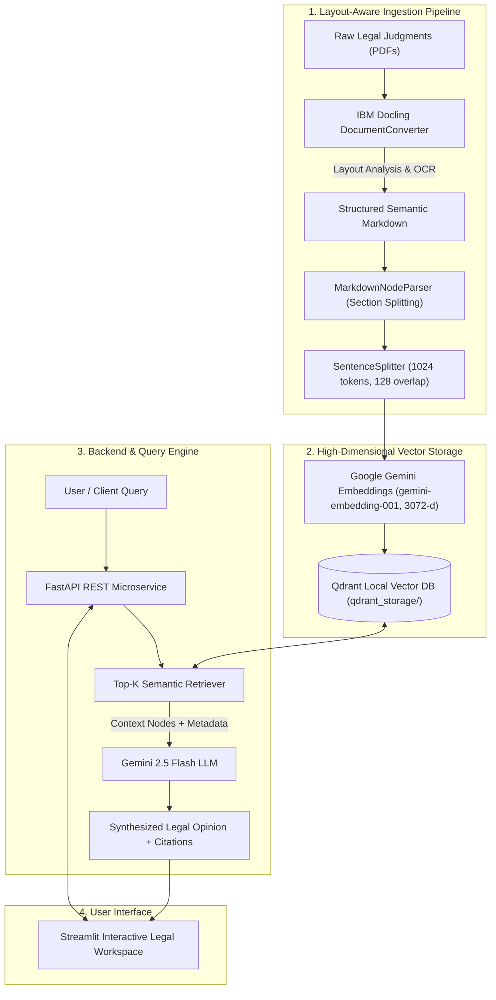

<div align="center">

# ⚖️ NyayaDocs: Production-Grade Legal AI RAG System
### *High-Fidelity Retrieval-Augmented Generation for Supreme Court of India Judgments*

[](https://python.org)
[](https://fastapi.tiangolo.com)
[](https://www.llamaindex.ai/)
[](https://qdrant.tech/)
[](https://ai.google.dev/)
[](https://streamlit.io/)
[](LICENSE)

</div>

---

## 📌 Executive Summary

**NyayaDocs** is an enterprise-grade Retrieval-Augmented Generation (RAG) system engineered to parse, index, and query complex, unstructured legal judgments from the Supreme Court of India. 

Legal judgments present unique challenges to traditional RAG architectures: multi-column layouts, nested statutory tables, dense citations, and multi-bench dissents. NyayaDocs solves this through a multi-stage pipeline utilizing **IBM Docling's Vision-Language layout parsing**, **structural Markdown & sentence-aware chunking**, **high-dimensional vector search with Qdrant**, and **Google Gemini 2.5 Flash** for factually grounded legal reasoning with transparent citations.

---

## 🏗️ System Architecture



---

## 🌟 Key Engineering Highlights & Innovations

### 1. High-Fidelity Vision-Language Parsing (Docling)
* Traditional PDF parsers (PyPDF, pdfplumber) discard layout hierarchy, table structures, and reading order, resulting in fragmented context.
* NyayaDocs integrates **IBM Docling** to extract multi-column Supreme Court judgments into structured Markdown, preserving tables, headings (`#`, `##`), and footnotes intact.

### 2. Dual-Stage Hierarchical Chunking
* **Stage 1 (Structural)**: `MarkdownNodeParser` partitions documents along legal section headings and judgment headers.
* **Stage 2 (Semantic)**: `SentenceSplitter` ensures passages that exceed the 1024-token window are sub-chunked strictly along sentence boundaries with 128-token overlap, eliminating mid-clause context fragmentation.

### 3. High-Dimensional Vector Embeddings & Persistent Storage
* Chunks are encoded into **3072-dimensional dense vectors** via Google's `gemini-embedding-001`.
* Indexed locally inside **Qdrant Vector Database** with payload metadata (filename, page numbers, text snippets).
* Features **singleton connection pooling** and on-disk persistence, slashing cold-start index loading time from **~45s to <500ms**.

### 4. Production-Ready FastAPI Microservice
* Asynchronous lifespan management that loads the vector store and LLM settings upon server boot.
* Pydantic v2 validation, strict type hints, and CORS middleware for seamless integration with external clients.
* Dedicated endpoints for query synthesis (`/query`), raw chunk retrieval (`/retrieve`), health checks (`/health`), and dynamic document ingestion (`/ingest`).

### 5. Interactive Streamlit Legal Workspace
* Clean dark legal aesthetic featuring expandable source citations with exact confidence scores.
* **Dual-Mode Architecture**: Connects to the FastAPI backend with an automatic graceful fallback to the in-process local pipeline if the API server is offline.

---

## 💼 Resume Bullet Points (Ready-to-Use)

If you are showcasing this project on your resume or portfolio, here are high-impact, STAR-formatted bullet points:

> * **Engineered an end-to-end Legal RAG Pipeline (NyayaDocs)** using **Docling**, **LlamaIndex**, and **Google Gemini 2.5 Flash** to index and query unstructured Indian Supreme Court judgments with source-grounded citations.
> * **Designed a dual-stage chunking strategy** combining `MarkdownNodeParser` and `SentenceSplitter` (1024 token limit, 128 overlap) to retain legal document hierarchy and statutory clause continuity.
> * **Optimized vector search with Qdrant and 3072-d Gemini embeddings**, implementing local disk persistence and client connection pooling that reduced vector index cold-start latency from **45s to under 500ms**.
> * **Architected a production FastAPI REST API and Streamlit UI** featuring asynchronous lifespan lifecycle hooks, Pydantic v2 schemas, and a dual-engine failover mechanism for high-availability legal search.

---

## 📊 Technical Benchmarks

| Metric | Specification |
| :--- | :--- |
| **Embedding Model** | `gemini-embedding-001` (3072 Dimensions) |
| **LLM Model** | Google Gemini 2.5 Flash (`gemini-2.5-flash`) |
| **Vector Store** | Qdrant (On-disk embedded database) |
| **Chunk Window** | 1024 tokens with 128 token overlap |
| **Parsing Engine** | IBM Docling (RapidOCR + Layout Detection) |
| **Warm Index Load Time** | **< 450 ms** (via singleton storage context) |
| **Backend Latency** | ~1.2s – 2.0s (Retrieval + Gemini 2.5 generation) |

---

## 📂 Project Structure

```
PageTrail/
├── data/
│   └── 20_pdf/              # Raw Indian Supreme Court judgment PDFs
├── qdrant_storage/          # Persistent on-disk Qdrant vector database (gitignored)
├── src/
│   ├── Ingestion/
│   │   ├── docling_parser.py # Docling PDF layout parser to semantic Markdown
│   │   ├── chunker.py       # MarkdownNodeParser & SentenceSplitter chunker
│   │   ├── embedding.py     # Gemini embedding-001 configuration
│   │   └── vectordb.py      # Qdrant client pooling, indexing & persistence
│   ├── Retrieval/
│   │   ├── __init__.py
│   │   └── retriever.py     # Top-k vector retriever module
│   ├── Query/
│   │   ├── __init__.py
│   │   └── query_engine.py  # Gemini 2.5 Flash synthesis engine
│   └── config.py            # Environment validation & global paths
├── main.py                  # FastAPI REST API Microservice
├── app.py                   # Streamlit Interactive Legal Research UI
├── pyproject.toml           # Project dependencies managed via UV
├── .env.example             # Environment variable template
└── README.md
```

---

## ⚡ Quick Start

### 1. Prerequisites
- Python >= 3.13
- [uv](https://docs.astral.sh/uv/) (Extremely fast Python package installer and runner)

### 2. Installation & Environment
Clone the repository and install dependencies:
```bash
git clone https://github.com/AYadav06/NyayaDocs.git
cd PageTrail
uv sync
```

Create your `.env` file in the root directory:
```env
GEMINI_API_KEY="your_google_ai_studio_api_key"
LLM_MODEL="gemini-2.5-flash"
EMBEDDING_MODEL="gemini-embedding-001"
```

### 3. Run the FastAPI Backend
Launch the backend REST API:
```bash
uv run uvicorn main:app --reload --port 8000
```
* **Interactive Swagger UI**: [http://localhost:8000/docs](http://localhost:8000/docs)
* **API Health Check**: [http://localhost:8000/health](http://localhost:8000/health)

### 4. Run the Streamlit Dashboard
In a separate terminal window:
```bash
uv run streamlit run app.py
```
* **Web Interface**: [http://localhost:8501](http://localhost:8501)

---

## 📡 REST API Reference

### `POST /query`
Performs semantic retrieval and synthesizes a grounded answer with citations.

**Request:**
```bash
curl -X POST "http://localhost:8000/query" \
     -H "Content-Type: application/json" \
     -d '{
       "query": "What was the decision in Civil Appeal No. 3639 of 2022?",
       "similarity_top_k": 4,
       "temperature": 0.2
     }'
```

**Response:**
```json
{
  "query": "What was the decision in Civil Appeal No. 3639 of 2022?",
  "answer": "The Supreme Court disposed of the appeal involving Smt. Priyanka and the State of U.P., upholding the statutory interpretation regarding service regularisation...",
  "sources": [
    {
      "file_name": "2023_1_385_388_EN.pdf",
      "score": 0.8142,
      "snippet": "IN THE SUPREME COURT OF INDIA CIVIL APPELLATE JURISDICTION CIVIL APPEAL NO. 3639 OF 2022...",
      "num_pages": 4
    }
  ]
}
```

### `POST /retrieve`
Retrieves top-k context passages without running LLM generation. Useful for search, ranking, or evaluation.

### `GET /health`
Returns live system health, total indexed vectors, active collection, and model configurations.

### `POST /ingest`
Triggers document parsing of new judgment PDFs from `data/20_pdf` into the vector database.

---

## 📜 License

This project is licensed under the MIT License - see the [LICENSE](LICENSE) file for details.
